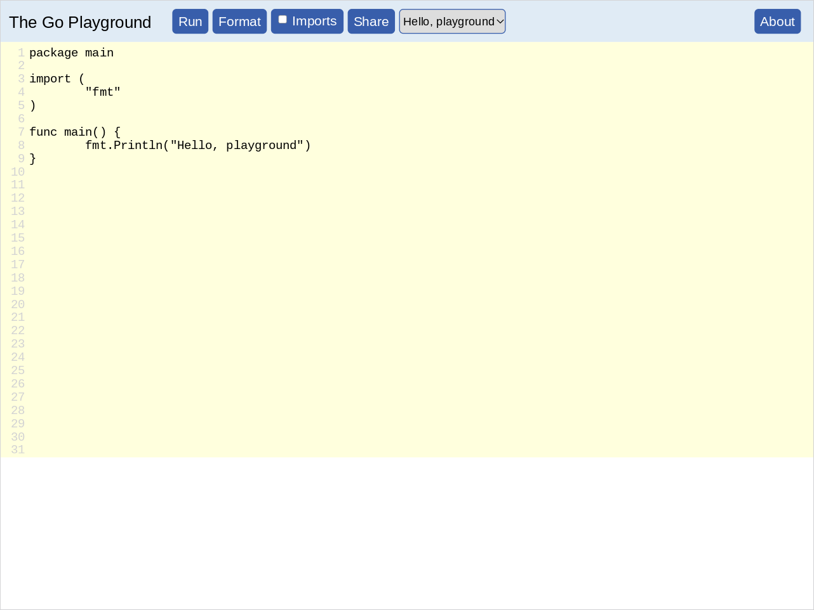
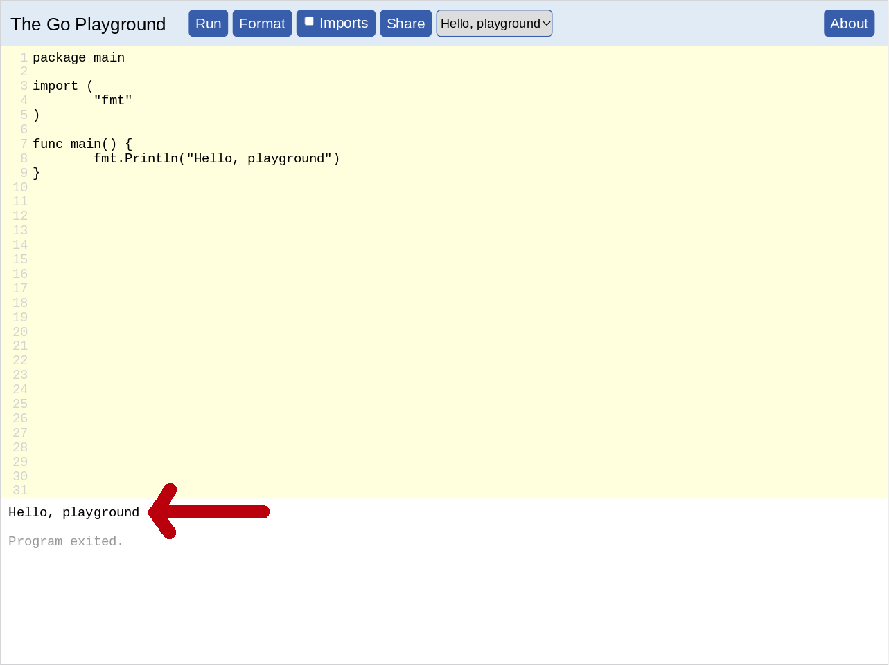

# Learn Golang In One Day

**Go** — also written as **Golang** — is a popular programming language.

This one day **workshop** aims to help you learn to be able to **code** in **Go**.

## PLAY.GOLANG.COM

One of the easiest ways to get started with **Go** is by going to https://play.golang.com/

When you get there you should see something like the following:



When you go to https://play.golang.com/ , it will have some **Go** **code** in there already for you.

```Go
package main

import (
	"fmt"
)

func main() {
	fmt.Println("Hello, playground")
}
```

You can **run** this code by clicking the blue colored button with “Run” written on it:


After you click the the blue colored button with “Run” written on it, that **Go** program will output some text.

That outputted text will be displayed at the bottom of the screen, in the white colored area:


If you are having trouble locating the outputted text, it is here:



Note that what is in between the double quotation marks in the code. I.e.,…
```Go
	fmt.Println("Hello, playground")
```

… is what you see in the output. I.e.,…
```
Hello, playground
```

## PLAY.GOLANG.COM — Hello world!

Now let's edit that **Go** **code**.

Let's change this code:
```Go
	fmt.Println("Hello, playground")
```

… to be:
Let's change this code:
```Go
	fmt.Println("Hello world!")
```


So the whole code would become:
```Go
package main

import (
	"fmt"
)

func main() {
	fmt.Println("Hello world!")
}
```

I.e.,…


Now run that.

And the output you should see should be:


## PLAY.GOLANG.COM — Hello YOUR NAME

Let's get more personal. Let's make that code say our name.

So we are going to change this line:
```Go
	fmt.Println("Hello world!")
```

To something like:
```Go
	fmt.Println("Hello Charles!")
```

Of course, instead “Charles” you should put whatever your name is.

So, if your name if “Robert”, then your code would be:
```Go
	fmt.Println("Hello Robert!")
```

And if your name is “Elizabeth”, then your code would be:
```Go
	fmt.Println("Hello Elizabeth!")
```

But I have to show some name in the screenshot, so I'll just use “Charles”:


Now run that.

And the output you should see should be something like:


Of course, the name you have outputted will be whatever name you used.
